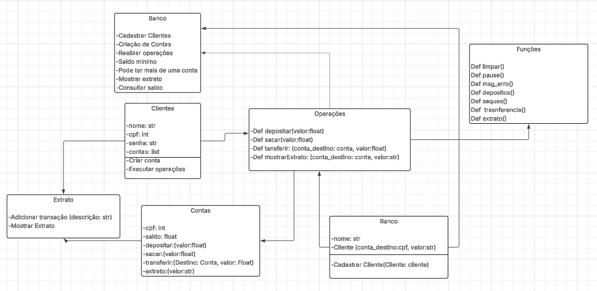

# Projeto Avaliativo: Sistema Bancário - NexusBank 💸
## 1️⃣ Introdução
Projeto avaliativo de programação back-end em Python com o objetivo de criar um sistema bancário para uma instituição. O sistema deve conter funções de saque, depósito, transferências e consulta de saldo. O banco deve conter também dois tipos de contas diferentes (Conta Corrente e Conta Poupança), cada um com suas regras, sendo utilizado POO (Programação Orientada a Objetos). Utilizaremos a biblioteca "Getpass", no qual tem a função de ocultar senhas.
## 2️⃣ Grupo e Função
Cada integrante do grupo tem suas seguintes funções:
| Colaborador | Perfil | Função |
|-------------|--------|--------|
| Gabriel Leonardo Vicente Cancian | [GitHub](https://github.com/GabrielLeonardoVC) | Diagrama de Classes UML |
| Gabriel Portocarrero de Oliveira| [GitHub](https://github.com/GabrielPortocarrero) | Documentação no README |
| Guilherme Ballestrim Sobreira| [GitHub](https://github.com/GuilhermeBallestrim) | Construção de classes no arquivo classes.py |
| João Vitor Alves daCosta  | [GitHub](https://github.com/Joaovacosta) | Documentação no README |
| Matheus Lima Catarucci | [GitHub](https://github.com/MatheusCatarucci) | Construção de funções no arquivo fun.py |
| Moisés Gabriel Tafarello | [GitHub](https://github.com/MoisesTafarello) | Construção de classes no arquivo classes.py |
## 3️⃣ Requisitos Funcionais 💡
### Conta no geral
A conta deve conter as seguintes funções:
| 🧩 Requisito | ⚙ Função |
|-----------|-----------|
| Depósito | Depositar dinheiro na conta corrente ou poupança |
| Saque | Sacar dinheiro na conta corrente ou poupança |
| Transferência | Realiza a transferência bancária para outra conta |
| Saldo e extrato | Realiza a consulta do saldo e extrato da conta |
### Conta Corrente e Poupança
| 👥 Conta | ⚙ Função |
|---------|---------|
| Corrente | Permite saques sem saldo mínimo. |
| Poupança | Exige saldo mínimo de R$ 100,00 para saques. |
#### Observações
- Cada cliente pode contar mais de uma conta
- Todas as operações devem ser registradas em um extrato vinculado à conta.

## 4️⃣ Requisitos Técnicos - POO/Explicação do código
Em espera...

## 5️⃣ Diagrama de Classes UML

[Clique Aqui para acessar o Diagrama de Classes UML](https://lucid.app/lucidchart/fea066e8-6598-4cda-8514-896bf2a63cd4/edit?invitationId=inv_adee2969-7860-4abe-8ec9-08f3c9c67542&page=0_0#)

