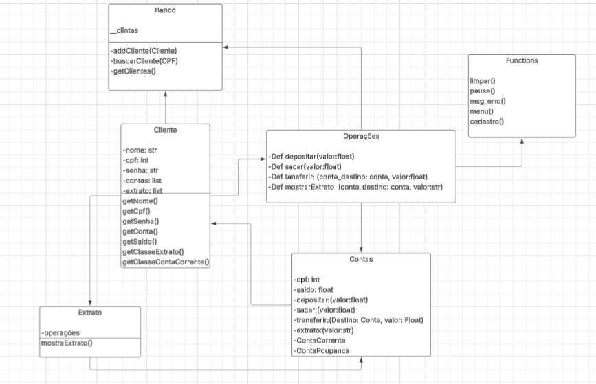

# Projeto Avaliativo: Sistema Bancário - NexusBank 💸
## 1️⃣ Introdução
Projeto avaliativo de programação back-end em Python com o objetivo de criar um sistema bancário para uma instituição. O sistema deve conter funções de saque, depósito, transferências e consulta de saldo. O banco deve conter também dois tipos de contas diferentes (Conta Corrente e Conta Poupança), cada um com suas regras, sendo utilizado POO (Programação Orientada a Objetos). Utilizaremos a biblioteca "Getpass", no qual tem a função de ocultar senhas.
## 2️⃣ Grupo e Função
Cada integrante do grupo tem suas seguintes funções:
| Colaborador | Perfil | Função |
|-------------|--------|--------|
| Gabriel Leonardo Vicente Cancian | [GitHub](https://github.com/GabrielLeonardoVC) | Diagrama de Classes UML |
| Gabriel Portocarrero de Oliveira| [GitHub](https://github.com/GabrielPortocarrero) | Documentação no README |
| Guilherme Ballestrim Sobreira| [GitHub](https://github.com/GuilhermeBallestrim) | Construção de classes no arquivo classes.py |
| João Vitor Alves da Costa  | [GitHub](https://github.com/Joaovacosta) | Documentação no README |
| Matheus Lima Catarucci | [GitHub](https://github.com/MatheusCatarucci) | Construção de funções no arquivo fun.py |
| Moisés Gabriel Tafarello | [GitHub](https://github.com/MoisesTafarello) | Construção de classes no arquivo classes.py |
## 3️⃣ Requisitos Funcionais 💡
### Conta no geral
A conta deve conter as seguintes funções:
| 🧩 Requisito | ⚙ Função |
|-----------|-----------|
| Depósito | Depositar dinheiro na conta corrente ou poupança |
| Saque | Sacar dinheiro na conta corrente ou poupança |
| Transferência | Realiza a transferência bancária para outra conta |
| Saldo e extrato | Realiza a consulta do saldo e extrato da conta |
### Conta Corrente e Poupança
| 👥 Conta | ⚙ Função |
|---------|---------|
| Corrente | Permite saques sem saldo mínimo. |
| Poupança | Exige saldo mínimo de R$ 100,00 para saques. |
#### Observações
- Cada cliente pode contar mais de uma conta
- Todas as operações devem ser registradas em um extrato vinculado à conta.

## 4️⃣ Requisitos Técnicos - POO/Explicação do código
---
### Classes e Objetos 🏗️
`Banco`: Classe responsável por armazenar contas de clientes e gerenciar buscas e cadastros.
`Cliente`: Reprensenta uma pessoa que tem essa conta no banco.
`Conta`(Abstrata): Faz a definição de dois tipos de contas diferentes, a `ContaCorrente` e a `ContaPoupanca`.
Extrato: Registra as operações financeiras.
> Cada classe reflete uma entidade diferente, no qual separa suas responsabilidades.
> 
### Encapsulamento 🔒
- A maioria dos atributos estão privados e são acessados via GETs/SETs.
> Protege os dados mais sensíveis (Saldo, CPF e senha).
>
### Herança 🧬
- A classe `Conta` é abstrata e é herdada por `ContaCorrente` e a `ContaPoupanca`.
- Outros comportamentos que foram reaproveitados são `depositar()`, `sacar()`, `transferir()`
> Evita duplicação de mesmos métodos e facilita na manutenção do código.
>
### Polimorfismo 🎭
- Foi aplicado nas subclasses `ContaCorrente` e a `ContaPoupanca`. Pois o programa pode chamar `conta.sacar(valor)` independente do tipo da conta que está.
### Abstração ☁️
- A `conta` não pode ser instanciada diretamente, pois ela define um modelo de conta, mesmo deixando dois tipos de subclasse. 
### Associação 🔗
- Cliente está associado a conta, onde ambas podem existir separadamente.
```
self.__contas = []
self.__contaCorrente = ContaCorrente()
```
### Agregação ⚪➕⚫
- O banco tem uma lista de clientes dentro dele, mas essas contas podem existir sem o banco.
```
class Banco:
    def __init__(self):
        self.__clientes = []
``` 
### Composição 🧱
- `Conta` possui uma área de extrato.
- O extrato só deve existir enquanto a conta existe 
> A explicação disso ser uma composição, é porque a existência do extrato depende da conta.
>
### Sobrecarga de Métodos 🔁
- É aplicado nas classes `ContaCorrente` e `ContaPoupanca`, que herdam da classe base abstrata Conta.
> Embora os métodos possuam o mesmo nome e parâmetros, o comportamento pode variar conforme a classe que os implementa, caracterizando a sobrecarga de métodos dentro da hierarquia de herança.
>
### Interfaces 🧠💬
- A interface OperacoesFinanceiras define o contrato das operações essenciais de qualquer conta.
> Isso obriga todas as subclasses a implementarem esses métodos, garantindo consistência no sistema e facilitando futuras expansões.
>

## 5️⃣ Diagrama de Classes UML



[Clique Aqui para acessar o Diagrama de Classes UML](https://lucid.app/lucidchart/fea066e8-6598-4cda-8514-896bf2a63cd4/edit?viewport_loc=-437%2C-562%2C3347%2C1463%2C0_0&invitationId=inv_adee2969-7860-4abe-8ec9-08f3c9c67542)


